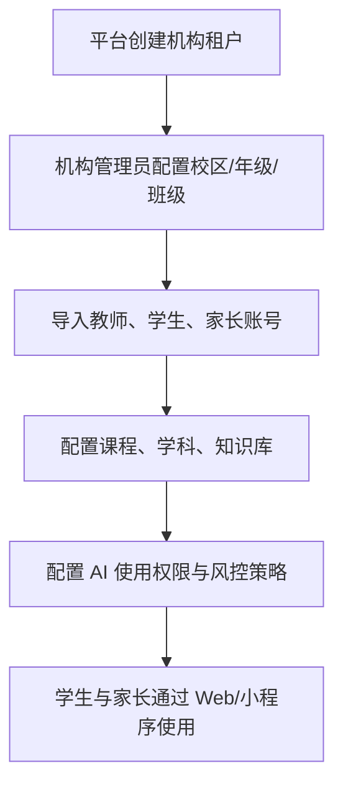
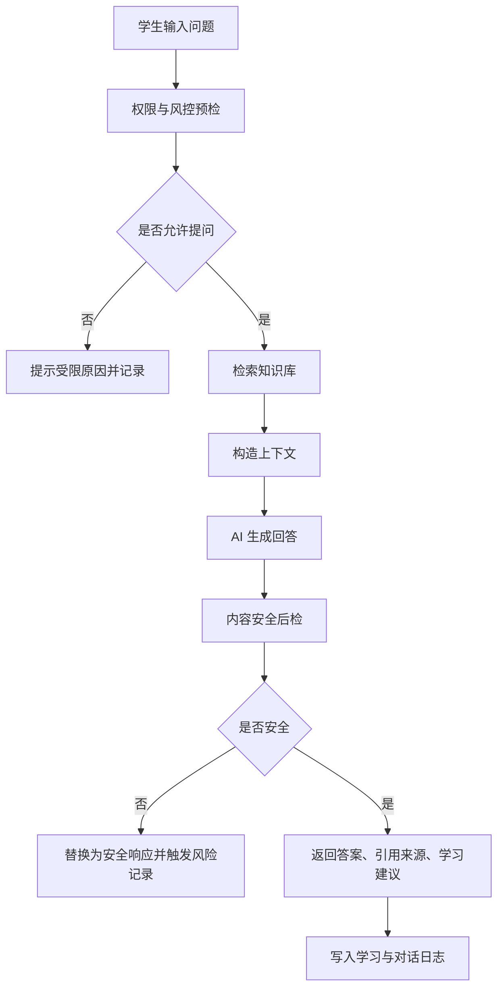
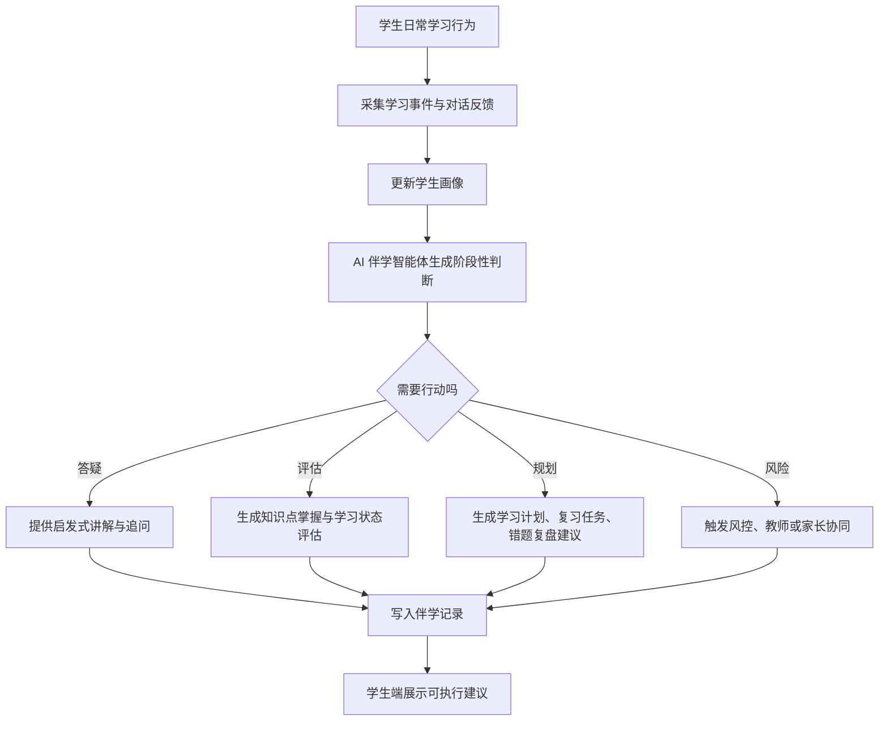
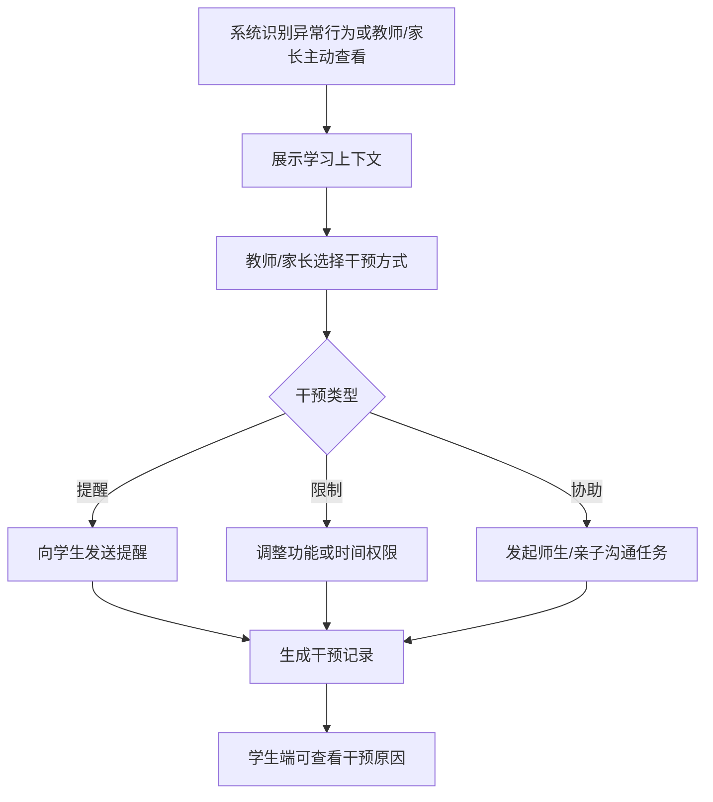
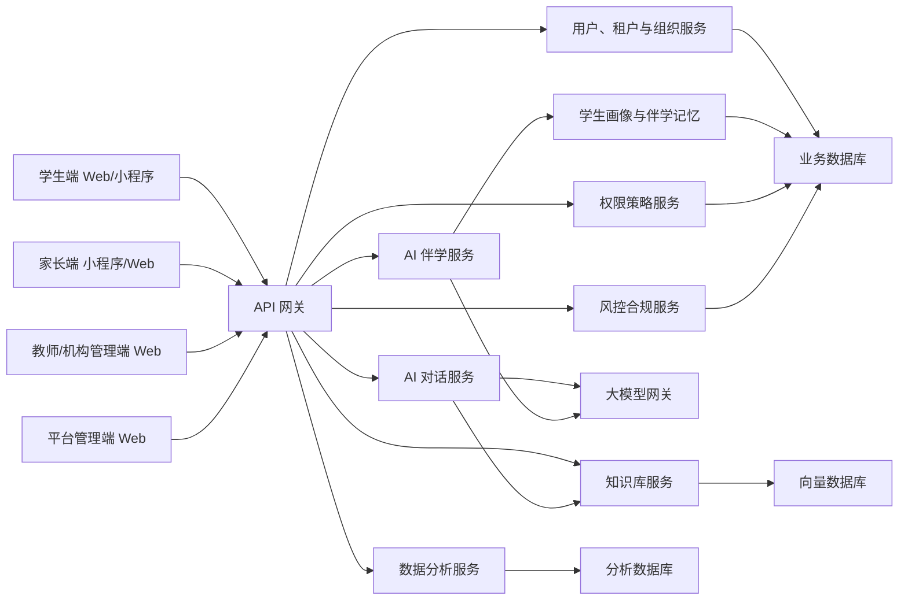

# 教育类 AI 智能体应用产品设计方案

## 1. 文档目标

本文档用于定义一款面向学校与教育机构场景的 AI 智能体应用产品，覆盖「AI 伴学智能体 + AI 知识库对话 + 学生/家长双端协同 + 校方管理 + 权限透明干预 + 风控合规 + 数据可视化」的全流程设计。

本文档仅作为产品设计与方案评估依据，不包含具体开发计划与工程实施排期。开发计划需在本设计方案确认后单独形成。

## 2. 产品定位

### 2.1 产品名称

暂定名：EduAI Campus

### 2.2 一句话定位

面向初高中学校与教育机构的可信 AI 伴学与管理平台，通过为每个学生打造长期陪伴的 AI 伴学智能体，结合机构知识库问答、学习评估、成长规划、家长协同、教师/机构管理、透明干预、合规风控和数据分析，帮助机构提升教学服务效率，也让学生、家长和校方在可解释、可授权、可追溯的机制下协同学习。

### 2.3 核心价值

- 对学生：获得安全、准确、个性化、持续陪伴式的 AI 学习成长支持。
- 对家长：了解孩子学习过程，参与学校/机构授权范围内的透明协同。
- 对教师/机构：沉淀课程知识库、掌握学生学习状态、通过 AI 伴学智能体提升答疑、评估、规划和督学效率。
- 对平台：建立合规、安全、可运营、可持续扩展的教育 AI 产品底座。

## 3. 目标用户与角色

### 3.1 学生端

学生端是主要学习入口，首期覆盖 Web 与小程序，重点能力包括 AI 伴学、AI 问答、机构知识库学习、错题复盘、教师任务执行、学习报告查看和向教师/家长求助。

典型用户：

- 初中学生
- 高中学生
- 参加学校或机构课程的课后自主学习学生

### 3.2 家长端

家长端是协同监督与授权入口，首期以小程序为主、Web 为辅，重点能力包括学习过程查看、风险提醒、授权确认、干预记录、成长趋势分析和亲子沟通。

典型用户：

- 关注孩子学习进度的家长
- 需要管理孩子 AI 使用边界的监护人
- 需要定期了解孩子知识薄弱点的家庭教育参与者

### 3.3 教师端

教师端是教学管理与学习干预入口，首期建议并入 Web 管理端，重点能力包括班级学生概览、知识库维护、任务布置、学习数据查看、风险提醒处理和干预建议。

典型用户：

- 初高中任课教师
- 班主任
- 教研组负责人

### 3.4 机构管理端

机构管理端用于学校/机构的账号、班级、课程、知识库、风控策略、数据看板和运营配置。

典型用户：

- 学校管理员
- 教务管理员
- 机构运营人员
- 内容审核人员
- 风控合规人员

### 3.5 平台管理端

平台管理端面向 SaaS 平台运营方，用于租户管理、全局风控策略、系统配置、模型配置、审计与运维。

## 4. 产品边界

### 4.1 本期核心范围

- AI 知识库对话
- AI 伴学智能体
- 学生端学习助手
- 家长端协同监督与授权
- 教师端/机构端管理后台
- 权限透明干预机制
- 基础风控与内容安全
- 学习数据可视化
- Web 端与小程序端
- 初高中学段核心场景

### 4.2 暂不纳入首期范围

- 完整在线课堂直播系统
- 大规模校务管理系统
- 第三方教辅商城
- 复杂 LMS 学习管理系统
- 自动批改大作文的高精度评分体系
- 面向公开互联网的开放插件市场
- 原生 iOS / Android App
- 小学低龄适配
- 家庭 C 端独立获客与商业化闭环

## 5. 核心业务流程

### 5.1 机构入驻与账号开通流程

关键设计：

- 机构租户拥有独立数据空间。
- 学生账号归属班级、课程和机构租户。
- 家长账号通过学生关系绑定，不直接拥有机构级管理权限。
- 初中、高中、年级、课程影响默认风控策略和知识库范围。
- 机构、教师、家长的权限配置需要保留历史变更记录。

### 5.2 AI 知识库对话流程

关键设计：

- 回答必须优先基于知识库引用，不能只依赖模型自由生成。
- 高风险问题不直接回答，给出安全解释，并按策略同步给教师、家长或机构管理员。
- 对话结果需要支持来源追溯、风险标记和家长复核。

### 5.3 AI 伴学智能体工作流程

关键设计：

- 每个学生拥有一个长期伴随的 AI 伴学智能体，而不是一次性聊天窗口。
- 伴学智能体基于学习记录、知识点掌握度、错题、对话反馈和教师任务形成学生画像。
- 伴学智能体输出必须可解释，关键建议需要说明依据，例如错题、知识点、任务完成情况或近期提问。
- 涉及心理、家庭、校园安全、重大升学决策等高敏内容时，伴学智能体只能做安全引导和转介，不能替代专业人员判断。
- 学生可以看到伴学建议，教师和家长根据权限查看摘要、趋势和需要协同的事项。
- AI 伴学推送提醒默认关闭，只有学生、家长或机构在授权范围内开启后，才按已配置规则推送。
- AI 伴学长期记忆默认保留 2 周，可由机构在合规上限内自定义，最大上限为 90 天；超过保留期后进入摘要化、清理或归档流程。

### 5.4 教师/家长透明干预流程

关键设计：

- 教师和家长干预必须透明，学生端可看到原因、范围、时效。
- 干预动作不能只做后台静默控制。
- 干预记录需要可追溯，避免误解和滥用。

## 6. 功能模块设计

### 6.1 AI 知识库对话模块

核心能力：

- 多学科知识库问答
- 基于课程、教材、上传资料的 RAG 检索
- 答案引用来源展示
- 追问与上下文理解
- 学习路径建议
- 错题与薄弱点自动归类
- 不确定答案提示

功能要求：

- 支持按学段、学科、知识库进行检索隔离。
- 支持知识库文档上传、解析、切片、向量化和版本管理。
- 支持回答置信度、引用来源和生成时间展示。
- 支持对回答进行点赞、点踩、纠错反馈。

可复用性评估：

- 知识库检索服务可复用于教师备课、客服问答、机构资料问答等场景。
- 对话记录、引用来源、反馈机制应设计为通用 AI 会话底座。

可测试性评估：

- 可通过固定知识库样本构造问答测试集。
- 可对检索召回率、回答引用准确率、敏感内容拦截率进行自动化测试。
- 对模型输出需使用规则断言 + 人工抽检结合。

说明文档要求：

- 知识库接入说明
- 文档切片规则说明
- RAG 问答质量评估说明
- 模型提示词与安全策略说明

### 6.2 学生端产品模块

核心能力：

- AI 伴学智能体
- AI 学习对话
- 今日学习任务
- 知识点练习
- 错题本
- 学习进度
- 成就与鼓励
- 向家长求助
- 使用限制提示

关键页面：

- 首页学习台
- AI 伴学页
- AI 对话页
- 知识库选择页
- 任务列表页
- 错题复盘页
- 学习报告页
- 权限说明页

设计原则：

- 学生端必须弱化复杂配置，突出学习任务和即时反馈。
- 风控拦截文案要清晰、克制，避免恐吓式提示。
- 对低龄学生使用更直接的视觉层级和短句说明。

可复用性评估：

- 学习任务组件、错题卡片、对话组件可复用于 Web、移动端和小程序。

可测试性评估：

- 可对任务状态流转、权限限制、对话提交、错题收藏进行端到端测试。

说明文档要求：

- 学生端使用说明
- 学习任务状态说明
- AI 回答可信度说明

### 6.3 AI 伴学智能体模块

AI 伴学智能体是产品差异化亮点，目标是围绕单个学生形成“长期、个性化、可解释、可干预、可合规”的成长陪伴能力。

核心能力：

- 个体学习画像：沉淀学生的年级、课程、目标、薄弱知识点、学习偏好、任务完成情况、错题分布、AI 使用习惯。
- 日常学习陪伴：学生可随时向伴学智能体提问，智能体根据学生画像选择讲解深度、追问方式和练习建议。
- 学习评估：阶段性评估知识点掌握度、学习投入、错题复盘效果、任务执行情况。
- 学习规划：生成日计划、周计划、考前复习计划、薄弱点补强计划。
- 主动提醒：根据任务截止、错题堆积、长时间未复习、连续提问卡点等事件发起提醒。
- 提醒推送设置：默认关闭；开启后可按学科、任务、时间段、频率、提醒渠道配置推送规则。
- 情绪与状态识别：识别明显的焦虑、厌学、挫败、过度依赖 AI 等信号，并进入保守引导或协同流程。
- 成长档案：形成伴学记录、阶段总结、学习建议、教师可见摘要和家长可见摘要。

伴学记忆分层：

| 记忆层 | 内容 | 存储策略 |
| --- | --- | --- |
| 基础画像 | 年级、班级、课程、目标、授权范围 | 结构化存储，可由机构和家长授权维护 |
| 学习画像 | 知识点掌握、错题、任务、提问偏好 | 结构化存储，定期更新 |
| 短期上下文 | 当前会话、近期任务、最近错题 | 短周期缓存，控制上下文长度 |
| 长期伴学记录 | 阶段总结、规划、关键反馈 | 默认保留 2 周，可配置但不能超过 90 天，过期后摘要化、清理或归档 |
| 风险记忆 | 风险事件、干预记录、复核结果 | 合规留存，严格权限控制 |

功能边界：

- 可以做：答疑、启发式讲解、知识点评估、学习计划、错题复盘建议、任务提醒、阶段总结。
- 谨慎做：心理状态判断、升学路线建议、亲子关系建议、学习压力建议，需要明确非专业诊断性质。
- 不应做：替代教师评分结论、替代心理咨询、直接代写作业、诱导学生绕过教师或家长监管、隐蔽收集敏感隐私。

可复用性评估：

- 学生画像、伴学记忆、学习规划和评估能力可复用于教师助手、家长助手、学习报告和机构运营分析。
- 伴学智能体应通过统一 Agent 编排层实现，后续可扩展不同学科、不同学校、不同教学模式的专属智能体。

可测试性评估：

- 可用固定学生画像和学习事件测试计划生成是否符合约束。
- 可用知识点掌握样本测试评估结果是否可解释。
- 可用风险样本测试伴学智能体是否触发安全引导、教师协同或家长协同。
- 可对伴学建议进行规则断言，例如必须包含依据、建议任务、完成标准。

说明文档要求：

- AI 伴学智能体设计说明
- 学生画像字段说明
- 伴学记忆与数据留存说明
- 学习评估与规划口径说明
- 伴学安全边界说明

### 6.4 家长端产品模块

核心能力：

- 绑定孩子账号
- 查看学习概览
- 查看 AI 使用记录
- 查看风险提醒
- 在机构授权范围内确认或调整部分使用权限
- 发起透明协同干预
- 查看亲子互动记录
- 接收周报和月报

关键页面：

- 家长首页
- 孩子学习概览
- 对话记录摘要
- 风险提醒中心
- 授权确认页
- 干预记录页
- 数据报告页

设计原则：

- 家长端展示学习趋势，不鼓励逐字监控所有对话。
- 高风险事件需要明确提示，普通学习问题只做摘要。
- 授权配置要解释影响范围，避免误操作。

可复用性评估：

- 权限管理、告警中心、报告卡片可复用于学校教师端或机构管理端。

可测试性评估：

- 可对绑定流程、权限变更、干预生成、风险告警推送进行集成测试。

说明文档要求：

- 家长端使用手册
- 权限策略说明
- 干预机制说明
- 数据指标解释说明

### 6.5 教师端与机构管理模块

核心能力：

- 教师班级首页
- 学生学习概览
- AI 伴学摘要查看
- 课程知识库管理
- 学习任务布置
- 风险提醒处理
- 学生使用权限建议
- 班级数据看板
- 机构账号与组织管理

关键页面：

- 教师工作台
- 班级学生列表
- 学生学习画像
- AI 伴学建议审核
- 课程知识库管理
- 学习任务管理
- 风险事件处理
- 机构运营看板
- 租户配置页

可复用性评估：

- 班级、课程、知识库、任务和数据看板可扩展到多校区、多机构、多学科。

可测试性评估：

- 可对班级导入、任务发布、知识库发布、风险处理、数据聚合进行集成测试。

说明文档要求：

- 教师端使用说明
- 机构后台配置说明
- 班级与课程数据导入说明

### 6.6 权限透明干预模块

核心能力：

- 学生功能权限控制
- AI 使用时段控制
- 知识库访问范围控制
- 高风险对话触发家长确认
- 教师主动干预
- 家长授权范围内干预
- 学生端可见干预原因
- 干预记录审计

权限类型：

- 功能权限：AI 对话、错题本、资料上传、外部链接访问。
- 时间权限：每日使用时长、可使用时间段、夜间限制。
- 内容权限：学科范围、知识库范围、敏感主题限制。
- 行为权限：连续追问次数、复制导出、反馈提交。
- 伴学权限：主动提醒、长期记忆、学习规划、家长摘要、教师摘要。
- 推送权限：默认关闭，开启后需记录开启人、规则、渠道、频率、起止时间和撤销记录。

透明干预规则：

- 每次限制必须包含原因、操作者、角色、起止时间、影响范围。
- 学生端需能查看当前限制说明。
- 家长端、教师端需按权限查看历史干预记录。
- 机构端和平台端需能审计异常干预行为。

可复用性评估：

- 权限与干预模块应独立为策略引擎，可服务多个终端和多个业务模块。

可测试性评估：

- 可通过策略矩阵测试不同年龄、角色、时间、内容类型下的授权结果。

说明文档要求：

- 权限模型说明
- 策略配置说明
- 干预审计说明

### 6.7 风控合规模块

核心能力：

- 输入内容安全检测
- 输出内容安全检测
- 未成年人保护策略
- 隐私数据脱敏
- 风险事件分级
- 人工复核队列
- 合规日志留存
- 数据删除与导出能力

风险类型：

- 自伤、自残、暴力、违法内容
- 成人内容、诱导消费、不适龄内容
- 隐私泄露，如身份证、住址、电话、学校班级等
- 学术作弊，如直接代写作业、考试作弊
- 过度依赖 AI，如长时间连续提问、跳过思考过程
- 家庭冲突类敏感表达
- 校园欺凌、心理危机、极端言论等校园安全风险
- AI 伴学越界建议，如替代心理咨询、过度干预学生生活、未经授权生成敏感画像

风险分级：

| 等级 | 描述 | 处理方式 |
| --- | --- | --- |
| L1 | 普通提醒 | 返回温和提示，记录轻量日志 |
| L2 | 学习偏差 | 引导思考，不直接给答案 |
| L3 | 敏感内容 | 拦截回答，推送教师/家长提醒 |
| L4 | 高危风险 | 拦截、告警、进入机构或平台人工复核 |

合规要求：

- 采集最小必要数据。
- 明确告知家长和学生数据用途。
- 敏感数据加密存储。
- 支持数据导出、注销、删除申请。
- 重要操作和模型响应保留审计日志。
- 未成年人相关能力默认采用更保守策略。

可复用性评估：

- 风控策略、风险事件、复核队列可独立为平台级安全服务。

可测试性评估：

- 可构建安全样本库，覆盖输入检测、输出检测、权限拦截和事件分级。

说明文档要求：

- 内容安全策略说明
- 隐私合规说明
- 风险事件处理手册
- 人工复核规范

### 6.8 数据可视化模块

核心能力：

- 学习时长趋势
- AI 使用频次
- 学科活跃度
- 知识点掌握情况
- 错题变化趋势
- 风险事件趋势
- 家长干预效果
- 知识库问答质量
- 各科成绩变化趋势
- 教师点评与指导建议
- 家长评价与奖励兑现
- 教师录入成绩与 Excel 模板导入成绩
- 标准导入模板：`templates/score_import_template.csv`

学生端指标：

- 今日学习任务完成率
- 连续学习天数
- 学科练习数量
- 错题复盘完成数
- AI 辅助学习次数
- AI 伴学计划完成率
- AI 伴学提醒响应率
- 各科成绩趋势

家长端指标：

- 周学习总览
- 学科投入分布
- 薄弱知识点 Top N
- 风险提醒数量
- 干预后的行为变化
- AI 伴学阶段总结
- 各科成绩变化图表
- 家长评价记录
- 家庭奖励承诺与兑现状态
- 物质奖励与精神奖励分类

教师/机构端指标：

- 班级学习活跃度
- 课程知识点掌握分布
- 学生各科成绩变化趋势
- 学生薄弱学科与薄弱知识点
- 教师点评覆盖率
- 学生风险事件分布
- 任务完成率
- AI 答疑高频问题
- AI 伴学建议采纳率
- 知识库命中率
- 教师干预处理率

平台端指标：

- 日活、周活、月活
- AI 请求量
- 知识库命中率
- 回答满意度
- 风控拦截率
- 人工复核处理时长
- 机构租户活跃度
- 学生账号激活率

可复用性评估：

- 指标采集、事件埋点、报表查询应设计为通用数据分析层。

可测试性评估：

- 可通过模拟事件验证指标计算准确性。
- 可通过固定时间窗口测试趋势统计和聚合逻辑。

说明文档要求：

- 埋点事件说明
- 指标口径说明
- 数据看板使用说明

## 7. 产品架构设计

### 7.1 逻辑架构

### 7.2 推荐技术选型

前端：

- Web：Vue 3 + TypeScript + Vite
- 小程序：uni-app 或 Taro，优先复用 TypeScript 业务层
- Pinia 状态管理
- Vue Router
- ECharts 或 AntV 用于可视化
- Element Plus 或 Naive UI 用于管理端

后端：

- Java Spring Boot 或 Python FastAPI
- PostgreSQL 作为主业务数据库
- Redis 用于缓存、限流、会话和任务状态
- pgvector、Milvus 或 Qdrant 用于向量检索
- Elasticsearch 可用于全文检索和日志检索

AI 与数据：

- 大模型网关适配多模型供应商
- RAG 检索增强生成
- 文档解析与切片任务队列
- 统一 Prompt 模板管理
- 风控规则引擎 + 模型安全检测结合

部署：

- Docker Compose 支持本地开发
- Kubernetes 支持生产部署
- Nginx 作为反向代理
- Prometheus + Grafana 做基础监控
- Loki 或 ELK 做日志检索

## 8. 数据模型草案

### 8.1 用户、租户与组织

- users：用户账号
- tenants：学校/机构租户
- campuses：校区
- classes：班级
- courses：课程
- enrollments：学生选课与班级关系
- guardians：家长与学生关系
- student_profiles：学生档案
- parent_profiles：家长档案
- teacher_profiles：教师档案

### 8.2 权限与干预

- permission_policies：权限策略
- permission_rules：具体规则
- intervention_records：干预记录
- consent_records：授权与同意记录
- audit_logs：审计日志

### 8.3 AI 与知识库

- knowledge_bases：知识库
- knowledge_documents：知识文档
- document_chunks：文档切片
- vector_indexes：向量索引元数据
- chat_sessions：对话会话
- chat_messages：对话消息
- answer_citations：答案引用
- ai_feedback：AI 回答反馈
- companion_agents：学生伴学智能体
- student_ai_profiles：学生 AI 学习画像
- companion_memories：伴学记忆摘要
- companion_memory_policies：伴学记忆保留策略
- companion_push_settings：伴学推送提醒设置
- companion_push_logs：伴学推送记录
- companion_plans：伴学计划
- companion_assessments：伴学评估
- companion_suggestions：伴学建议
- companion_events：伴学事件

### 8.4 学习数据

- learning_tasks：学习任务
- task_records：任务执行记录
- wrong_questions：错题
- knowledge_points：知识点
- mastery_records：掌握度记录
- learning_events：学习行为事件
- exam_scores：学生考试与测评成绩
- score_import_templates：成绩导入模板
- score_import_batches：成绩 Excel 导入批次
- score_comments：教师或家长对成绩趋势的点评
- reward_rules：家长奖励规则
- reward_redemptions：奖励兑现记录

### 8.5 风控合规

- risk_events：风险事件
- risk_rules：风控规则
- moderation_records：内容审核记录
- review_tasks：人工复核任务
- data_requests：数据导出、删除、注销请求

## 9. 权限模型设计

### 9.1 角色权限

| 角色 | 权限范围 |
| --- | --- |
| 学生 | 使用 AI 学习、查看自身任务和报告、查看权限说明 |
| 家长 | 查看孩子学习摘要、伴学摘要和各科成绩变化，处理授权确认，进行评价并记录奖励兑现 |
| 教师 | 管理班级学习任务、查看学生学习画像、伴学摘要和各科成绩趋势，维护课程知识库，处理风险提醒，进行点评与薄弱点指导 |
| 机构管理员 | 管理租户组织、账号、课程、知识库、权限策略和机构数据 |
| 平台运营 | 管理租户、查看平台运营数据、处理低风险复核 |
| 合规管理员 | 查看风险事件、处理高风险复核、配置安全规则 |
| 系统管理员 | 管理平台配置、模型配置、用户权限、系统审计 |

### 9.2 授权原则

- 最小权限原则：默认只开放必要能力。
- 监护授权原则：学生敏感能力由家长授权。
- 透明可见原则：限制与干预对学生可解释。
- 可撤销原则：家长授权与学生数据授权支持撤销。
- 可审计原则：关键操作必须留痕。

## 10. AI 智能体设计

### 10.1 智能体类型

| 智能体 | 作用 |
| --- | --- |
| AI 伴学智能体 | 面向单个学生长期陪伴，负责答疑、评估、规划、提醒、阶段总结和安全转介 |
| 学习答疑智能体 | 回答学习问题，启发式讲解，生成练习建议 |
| 错题复盘智能体 | 分析错因，生成同类题，跟踪掌握度 |
| 家长助手智能体 | 总结孩子学习情况，解释风险提醒，提供沟通建议 |
| 教师助手智能体 | 汇总班级学习情况，生成任务建议和干预建议 |
| 风控审核智能体 | 辅助识别风险内容，生成复核摘要 |
| 知识库管理智能体 | 辅助文档分类、标签、质量检查 |

### 10.2 AI 伴学智能体设计

定位：

- AI 伴学智能体是学生个人成长助手，围绕“学业问题、学习习惯、计划执行、阶段复盘、风险提醒”持续工作。
- 它不是普通聊天机器人，也不是只服务一次问答的工具，而是基于学生长期学习轨迹形成个性化反馈。

伴学能力：

- 答疑：根据学生水平调整解释深度，优先启发思考。
- 评估：根据错题、任务、提问、测评结果判断知识点掌握情况。
- 规划：生成可执行学习计划，拆分为任务、时间、目标和完成标准。
- 复盘：总结阶段学习变化，指出进步点和待改进点。
- 陪伴：以稳定、克制、正向的语气鼓励学生持续学习。
- 协同：必要时把摘要同步给教师或家长，而不是让学生独自处理复杂问题。

输出规范：

- 伴学建议必须包含依据、建议动作和完成标准。
- 推送提醒必须遵循用户设置，默认关闭；开启后按规则执行，不允许绕过设置频繁打扰。
- 长期记忆默认保留 2 周，允许自定义但最大上限为 90 天。
- 学习规划必须可执行，避免空泛鼓励。
- 对学生状态的判断必须使用“可能、倾向、建议关注”等非诊断表述。
- 涉及风险事件时优先触发安全流程，不能继续深聊高风险内容。

### 10.3 AI 回答原则

- 不直接代写作业，优先引导思考。
- 对知识性问题给出分步骤解释。
- 对不确定内容明确提示不确定性。
- 对知识库问答展示引用来源。
- 对敏感问题采用安全回复和求助引导。
- 对低龄用户使用更简单的语言。

## 11. 关键页面设计

### 11.1 学生端首页

主要区域：

- AI 伴学入口
- 今日伴学建议
- 今日任务
- AI 学习入口
- 最近学习知识点
- 错题复盘入口
- 当前权限状态
- 鼓励反馈

### 11.2 AI 对话页

主要区域：

- 对话窗口
- 知识库选择
- 引用来源
- 追问建议
- 反馈按钮
- 风控提示

### 11.3 AI 伴学页

主要区域：

- 伴学智能体状态
- 今日学习建议
- 当前薄弱点
- 学习计划
- 阶段评估
- 伴学提醒
- 推送提醒设置
- 长期记忆保留设置
- 最近复盘
- 权限与数据说明

### 11.4 家长端学习概览

主要区域：

- 学习总览卡片
- 学科投入趋势
- 各科成绩变化图表
- 薄弱知识点
- AI 使用摘要
- AI 伴学阶段总结
- 家长评价
- 奖励规则与兑现记录
- 风险提醒
- 干预入口

### 11.5 教师工作台

主要区域：

- 班级概览
- 今日任务进度
- 高频问题
- 薄弱知识点
- 学生各科成绩变化图表
- AI 伴学建议
- 教师点评与指导建议
- 风险提醒
- 待处理学生

### 11.6 权限管理页

主要区域：

- 功能权限
- 时间限制
- 内容范围
- 高风险确认策略
- AI 伴学记忆与主动提醒授权
- AI 伴学推送规则
- 长期记忆保留周期上限，最大 90 天
- 当前生效规则
- 历史变更记录

### 11.7 平台风控中心

主要区域：

- 风险事件列表
- 风险等级筛选
- 人工复核队列
- 规则命中详情
- 处理记录
- 趋势分析

## 12. 非功能需求

### 12.1 安全

- 账号密码加密存储。
- 敏感数据字段加密。
- API 接口鉴权。
- 管理端操作审计。
- AI 请求和响应进行安全检测。

### 12.2 性能

- 普通知识库问答首字响应建议小于 3 秒。
- AI 伴学评估与规划可异步生成，避免阻塞学生即时问答。
- 热门知识库检索结果可缓存。
- 对话流式输出降低等待感。
- 数据看板采用预聚合或异步统计。

### 12.3 可用性

- AI 服务异常时提供降级提示。
- 知识库不可用时提示数据来源不可访问。
- 风控服务异常时默认采用保守策略。
- 数据看板统计延迟需明确展示。

### 12.4 可扩展性

- 大模型供应商可切换。
- 知识库可按家庭、机构、课程隔离。
- 权限策略支持配置化扩展。
- 风控规则支持版本化。
- AI 伴学能力支持按租户、学段、学科、学生画像配置策略。

## 13. 里程碑建议

### 13.1 MVP 阶段

目标：验证学校/机构 B 端场景下的核心教育 AI 问答、组织账号、亲子协同、权限干预和基础数据看板。

周期：一期 MVP 计划用 2 周完成，目标是打通主线闭环，验证产品可行性，后续再基于该闭环扩展能力。

建议范围：

- 学生端 AI 对话
- 学生个人 AI 伴学智能体基础能力
- AI 伴学今日建议与阶段摘要
- 学生端 Web 与小程序基础使用
- 家长端小程序绑定和学习概览
- 教师/机构 Web 管理端
- 初高中课程知识库管理
- 基础权限策略
- 基础风控拦截
- 班级与学生学习事件统计
- 教师录入成绩和 Excel 模板导入
- 家长奖励规则与兑现记录

### 13.2 Beta 阶段

目标：强化风控、错题、报告和运营管理能力。

建议范围：

- 错题复盘
- AI 伴学计划、评估和长期记忆增强
- 家长周报
- 人工复核队列
- 知识库版本管理
- 风控策略配置
- 平台运营数据看板

### 13.3 正式版阶段

目标：形成可运营、可扩展、可合规上线的完整产品。

建议范围：

- 多租户、多校区、多班级扩展
- 完整数据合规能力
- 多模型网关
- 高级学习分析
- 更完整的学校/机构业务扩展能力
- 运维监控与告警体系

## 14. 执行风险

### 14.1 AI 回答准确性风险

风险说明：

- 大模型可能生成错误解释或无来源答案。
- 教育场景对准确性要求高，错误答案会直接影响学习。

建议控制：

- 使用 RAG 引用知识库。
- 展示引用来源。
- 建立回答反馈和纠错机制。
- 对高风险学科内容建立测试集。

### 14.2 未成年人合规风险

风险说明：

- 产品涉及未成年人数据、学习行为和家庭关系。
- 数据收集、展示和干预不当会产生合规风险。

建议控制：

- 默认最小化采集。
- 家长授权与学生可见并行。
- 敏感数据加密。
- 支持数据删除和导出。

### 14.3 家长过度监控风险

风险说明：

- 家长端如果展示过细的对话内容，可能引发信任问题。
- 亲子产品应避免变成单向监控工具。

建议控制：

- 默认展示摘要和风险事件。
- 原文查看设置更高权限和明确提示。
- 学生端展示干预原因。

### 14.4 风控误伤风险

风险说明：

- 学习问题可能被误判为敏感内容。
- 过度拦截会影响学习体验。

建议控制：

- 风险分级处理。
- 支持用户反馈。
- 高风险人工复核。
- 定期评估拦截样本。

### 14.5 成本风险

风险说明：

- AI 对话、向量检索和文档解析会带来持续成本。

建议控制：

- 对话限额。
- 缓存常见问题。
- 模型分层调用。
- 统计每个家庭和用户的成本指标。

### 14.6 AI 伴学过度拟人化与过度依赖风险

风险说明：

- 伴学智能体长期陪伴学生，容易让学生把 AI 当成权威、朋友或心理支持来源。
- 若边界设计不清，可能导致学生过度依赖 AI，弱化教师、家长和同伴互动。

建议控制：

- 明确 AI 伴学是学习辅助，不替代教师、家长或专业心理人员。
- 对连续高频使用、反复情绪倾诉、绕过作业思考等行为设置提醒和协同机制。
- 伴学建议必须鼓励学生独立思考，并在必要时引导联系教师或家长。

### 14.7 家长奖励兑现争议风险

风险说明：

- 家长奖励属于家庭激励行为，例如“数学达到 100 分奖励 100 元零花钱”。
- 如果系统直接介入支付或承诺兑现，可能产生资金、履约和家庭纠纷风险。

建议控制：

- 首期只记录奖励规则、触发条件、达成状态和兑现状态，不接入真实支付。
- 页面需明确奖励由家长自行承诺和执行，平台只提供记录和提醒。
- 奖励规则应支持家长手动关闭、修改和标记已兑现。

## 15. 已知错误与待确认问题

### 15.1 当前已知错误

- 当前仓库目录暂无可继承的已有代码结构，无法基于现有工程做架构复用判断。
- 首期终端已确认为 Web + 小程序，原生 App 暂不纳入。
- 首期用户范围已确认为学校/机构 B 端，面向初高中生。
- 首期学科范围已确认，主修学科为数学、物理、化学、英语，非学科方向为计算机应用、Java 开发、Python 开发等，并支持自定义学科分类和科目。

### 15.2 已确认约束

- 一期 MVP 周期为 2 周，优先打通主线闭环，后续在此基础上扩展。
- 首期小程序范围确认为微信小程序。
- AI 伴学长期记忆默认保留 2 周，自定义保留周期最大上限为 90 天。
- 成绩来源首期支持教师录入和 Excel 导入，需要提供标准导入模板。
- 家长奖励首期只做记录，不接入真实支付。
- 家长奖励分为物质奖励和精神奖励，需要记录奖励品级和兑现状态。

### 15.3 待确认问题

- 知识库来源是平台预置，还是支持家长 / 学生上传资料？
- 是否需要接入国内模型、本地模型或可替换多模型网关？
- 是否需要机构订阅、按学生数授权、按 AI 用量计费等商业化能力？
- Excel 成绩导入模板字段是否需要兼容现有学校格式。
- 家长奖励品级枚举是否由平台固定，还是允许家长自定义。

## 16. 方案结论

该产品的关键不是单纯做一个 AI 聊天入口，而是建立学校/机构场景下的可信 AI 伴学智能体系统。首期应优先实现「学生个人 AI 伴学可持续」「机构知识库问答可信」「学生/教师/家长关系清晰」「权限干预透明」「风控合规可追溯」「学习数据可解释」六个底座能力。

建议下一阶段在确认本设计方案后，形成独立的 `PLAN.md` 开发计划，明确技术栈、模块拆分、数据库表结构、接口清单、前端页面清单、测试策略、交付里程碑和验收标准。
